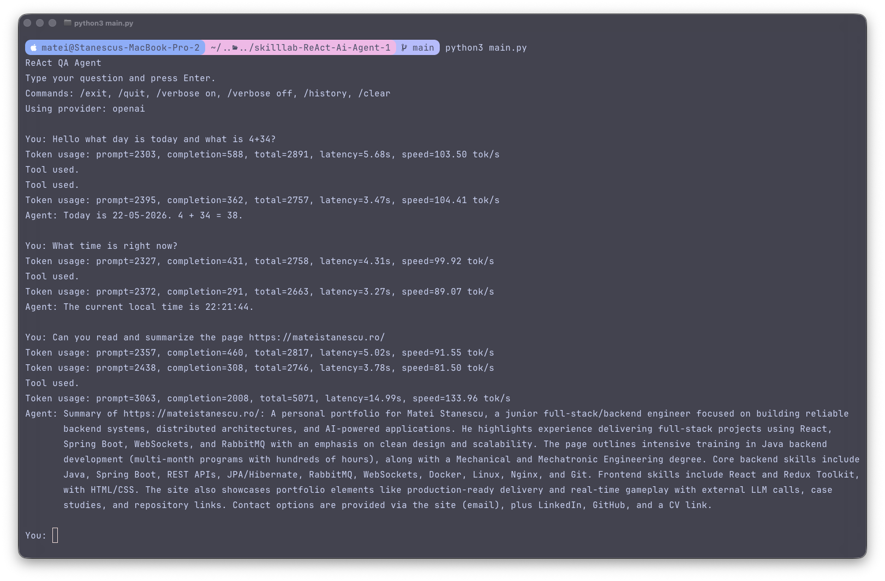

# SkillLab ReAct QA Agent

Homework project for the SkillLab AI Agent Development course. The goal was to implement a functional ReAct-style QA agent without starting from LangChain.
- tools, Pydantic schemas, YAML/Jinja prompts, provider calls, and the ReAct loop are wired manually.



## What This Project Does

This is an interactive command-line AI agent that can answer normal questions, remember the current chat session, and call Python tools when reliable external computation or retrieval is needed.

The agent follows a ReAct flow:

```text
User request -> LLM decides next action -> Python tool runs -> observation returns to LLM -> final answer
```

It supports:

- single tool calls
- multiple tool calls in one turn
- in-memory conversation history
- separate per-question ReAct scratchpad
- YAML/Jinja prompt registry
- Pydantic validation for tool parameters
- OpenAI and LiteLLM provider switching
- token usage, latency, and tokens/second logging
- verbose trace mode for debugging tool use
- code-level guardrails for required tool usage

## Project Structure

```text
.
├── agent.py                 # Provider adapters, ReAct loop, guardrails, token logging
├── main.py                  # Interactive CLI
├── tools/
│   ├── params_models.py     # Pydantic schemas for tool inputs
│   ├── registry.py          # TOOL_REGISTRY and @register_tool decorator
│   ├── tool_wrapper.py      # Safe tool validation/execution/catalog
│   └── basic_tools.py       # Calculator, date/time, news, and page tools
├── prompts/
│   ├── registry.py          # YAML loader and Jinja renderer
│   ├── extract.yaml         # User-intent/context understanding rules
│   ├── planner.yaml         # Tool-planning and response-shape rules
│   ├── analyst.yaml         # Observation analysis rules
│   └── summary.yaml         # Final-answer/output contract
├── cli-test.png             # CLI demonstration screenshot
├── .env.example             # Example provider configuration
└── README.md
```

## Available Tools

| Tool | Purpose |
| --- | --- |
| `calculator` | Evaluates simple arithmetic expressions safely after input validation. |
| `get_date` | Returns the current date or an offset date in `DD-MM-YYYY` format. |
| `get_time` | Returns the current local time in `HH:MM` or `HH:MM:SS` format. |
| `get_latest_news` | Reads Google News RSS headlines for a location/topic and returns titles, sources, dates, snippets, and URLs. |
| `get_page` | Fetches an accessible HTML page and extracts readable text for summarization. |

The news tools are intentionally honest about retrieval boundaries: RSS results are treated as headlines/snippets, not full article content. Full-page summaries are only based on `get_page` observations.

## Setup

This project targets Python 3.12+.

### Option 1: Using `uv`

If you use `uv`, install dependencies with:

```bash
uv sync
```

Then run:

```bash
uv run python main.py
```

### Option 2: Using standard `venv` and `pip`

If you do not use `uv`, create a virtual environment and install the same dependencies manually:

```bash
python3 -m venv .venv
source .venv/bin/activate
pip install jinja2 pydantic python-dotenv pyyaml requests
```

Create a local `.env` file from `.env.example`:

```bash
cp .env.example .env
```

Then configure one provider.

### OpenAI Provider

Recommended for the most consistent tool-calling behavior:

```env
LLM_PROVIDER=openai
OPENAI_API_KEY=YOUR_OPENAI_API_KEY
OPENAI_MODEL=gpt-5-nano-2025-08-07
```

### LiteLLM Provider

Useful for local experimentation with Ollama-backed models:

```env
LLM_PROVIDER=litellm
LITELLM_URL=http://localhost:4000/chat/completions
LITELLM_MODEL=gemma
```

Local models can work, but smaller/quantized models may be less consistent with strict JSON and tool-call formatting.

I tested Gemma 4 E4B with Q4_K_M quantization through Ollama/LiteLLM. It had good local speed, but it was less consistent than OpenAI with strict tool-call behavior.

### Provider Extensibility

The LLM layer uses a small factory/adapter pattern, so additional providers can be added by implementing another `LLMClient`. A Google Gemini adapter would fit naturally in this structure, but it is intentionally not included because I did not have a Google API key available for testing. I preferred shipping only provider paths that were actually verified.

## Running The Agent

If your virtual environment is active:

```bash
python3 main.py
```

Or with `uv`:

```bash
uv run python main.py
```

CLI commands:

```text
/verbose on   Show ReAct trace and tool calls
/verbose off  Hide ReAct trace
/history      Print current in-memory conversation history
/clear        Clear conversation history
/exit         Quit
/quit         Quit
```

Example prompts:

```text
What day is today and what is 4 + 34?
What time is right now?
Can you read and summarize https://example.com?
Give me 3 latest news headlines from Bucharest.
Tell me a short story for a kid that includes math calculations.
```

## ReAct And Memory Design

The project separates two memory concepts:

- **Conversation history**: previous user/assistant turns from the current CLI session.
- **ReAct scratchpad**: temporary tool calls, observations, corrections, and retries for the current user request.

This avoids polluting long-term chat memory with large raw tool outputs while still allowing each question to complete a multi-step reasoning loop.

## Guardrails

The agent uses prompt rules plus code-level guardrails. If the model tries to finalize before using a required tool, the loop adds a correction to the scratchpad and gives the model another iteration.

Current enforced cases:

- arithmetic expressions require `calculator`
- current date/day requests require `get_date`
- current time requests require `get_time`
- URL-reading requests require `get_page`
- malformed JSON responses trigger a format-repair iteration

This is visible in verbose mode as additional iterations before the final answer.

## Observability

Every model response logs token usage and request timing:

```text
Token usage: prompt=2303, completion=588, total=2891, latency=5.68s, speed=103.50 tok/s
```

Verbose mode additionally prints:

```text
Iteration 1
LLM response: ...
Calling tool: calculator
Tool args: ...
Observation: ...
```

This makes it clear whether the model answered directly or actually used a tool.

## Notes For The SkillLab Assignment

This implementation keeps the core mechanics explicit instead of delegating them to LangChain. That makes the moving parts easier to inspect:

- tool schema validation with Pydantic
- tool registration via decorators
- prompt loading with YAML and Jinja2
- provider abstraction with a small factory
- manual ReAct loop with tool observations
- recovery paths for invalid outputs

## Limitations

- Conversation history is in-memory only and resets when the CLI exits.
- RSS news results are headline/snippet based; they are not full article reads.
- `get_page` is best-effort and can be blocked by Cloudflare, paywalls, or JavaScript-heavy sites.
- Token budgeting is observed after each API call, but the project does not yet trim or summarize long history.
- The calculator is intentionally simple and restricted to basic arithmetic characters.
